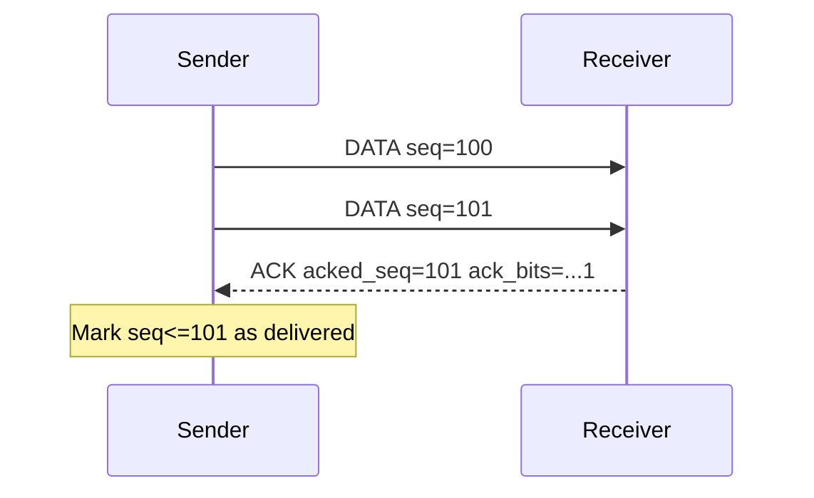
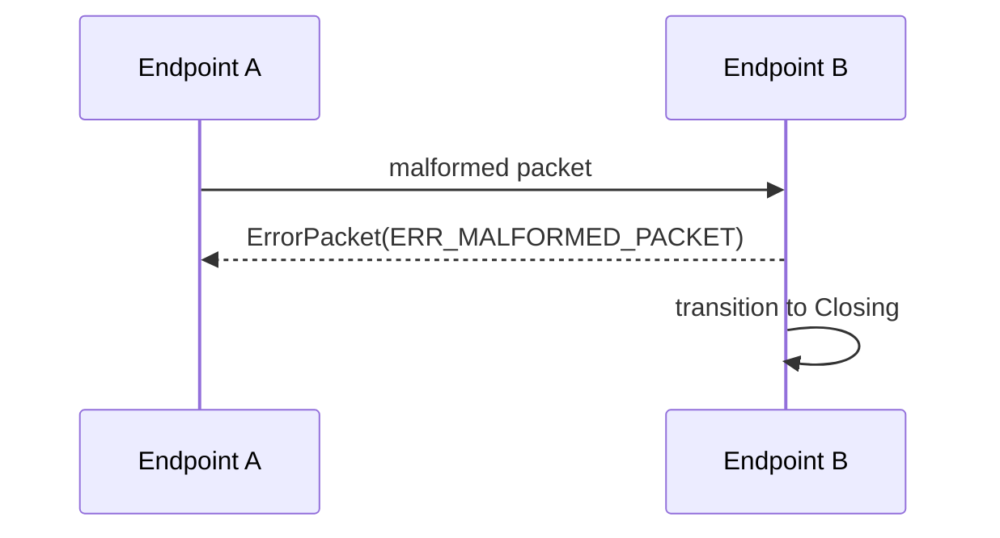

# VEP-003: Error Codes and ACK Semantics (V1)

- Status: Draft
- Type: Standards Track
- Created: 2026-06-11
- Author: mjojo (https://github.com/GLK-Dev)
- Requires: VEP-001

## 1. Abstract
This proposal standardizes V1 Error packet payloads and ACK behavior.
It defines machine-readable error codes, ACK frame format, and sender/receiver state rules required for interoperable reliability logic.

## 2. Scope
This VEP defines:

1. Error packet payload schema for packet_type=0xff.
2. ACK packet payload schema for packet_type=0x11.
3. Sender and receiver behavioral rules.

It does not mandate congestion-control algorithm choice.

## 3. Error Packet Payload
For packet_type=0xff, payload format is:

1. code (2 bytes, u16)
2. detail_len (2 bytes, u16)
3. detail_utf8 (N bytes)

Rules:

1. detail_utf8 MAY be empty.
2. detail_len MUST match exact UTF-8 byte length.
3. Receiver MUST ignore trailing bytes beyond declared length only if explicitly configured in compatibility mode; default behavior SHOULD fail packet parsing.

## 4. Error Code Registry (V1)
### 4.1 Generic
1. 0x0001: ERR_UNSUPPORTED_VERSION
2. 0x0002: ERR_MALFORMED_PACKET
3. 0x0003: ERR_UNEXPECTED_PACKET_TYPE
4. 0x0004: ERR_INVALID_SESSION
5. 0x0005: ERR_REPLAY_DETECTED
6. 0x0006: ERR_CAPABILITY_MISMATCH

### 4.2 Handshake
1. 0x0101: ERR_HANDSHAKE_FAILED
2. 0x0102: ERR_NO_SHARED_VERSION
3. 0x0103: ERR_NEGOTIATION_ECHO_MISMATCH

### 4.3 Flow/Resource
1. 0x0201: ERR_RATE_LIMITED
2. 0x0202: ERR_INTERNAL
3. 0x0203: ERR_BUSY_RETRY

## 5. ACK Payload Format
For packet_type=0x11, payload format is:

1. acked_seq (8 bytes, u64)
2. ack_bits (8 bytes, u64)

Meaning:

1. acked_seq is the highest contiguous sequence observed from peer.
2. ack_bits is a selective acknowledgment bitfield for prior packets.
3. Bit i in ack_bits acknowledges sequence acked_seq - (i + 1).

Example:

1. acked_seq = 100
2. ack_bits bit0 = 1 means seq 99 received.
3. ack_bits bit3 = 1 means seq 96 received.

## 6. ACK Processing Rules
Receiver behavior:

1. Endpoint SHOULD emit ACK periodically or piggyback when sending DATA.
2. Endpoint MUST include current highest contiguous seq from opposite direction.

Sender behavior:

1. Sender SHOULD track outstanding packets by seq.
2. Packet is considered acknowledged if covered by acked_seq or ack_bits.
3. Unacked packets MAY be retransmitted based on local timer policy.

## 7. Reliability and Reordering
1. V1 allows packet reordering in UDP transport.
2. Receiver MUST keep replay window semantics from VEP-001.
3. ACK handling MUST NOT disable replay checks.

## 8. Error Emission Rules
1. Endpoint SHOULD emit ErrorPacket before session termination when practical.
2. Endpoint MUST avoid reflection loops (do not send error in response to malformed error packet repeatedly).
3. Endpoint SHOULD rate-limit emitted errors per source.

## 9. Security Considerations
1. ACK spoofing risk is reduced by encrypted transport mode after handshake.
2. Implementations SHOULD validate ACK packets against active session_id and replay window.
3. Excessive error generation can be weaponized; rate limiting is mandatory in production.

## 10. Interoperability Checklist
1. Encode/decode roundtrip for Error payloads.
2. Encode/decode roundtrip for ACK payloads.
3. Retransmission state update from mixed acked_seq + ack_bits patterns.

## 11. Reference
1. VEP-001 for packet framing and sequence definitions.
2. VEP-002 for capability registry.
3. VEP-004 for state machine and lifecycle transitions.

## 12. ACK and Error Flows
### 12.1 ACK Flow

### 12.2 Error Flow

