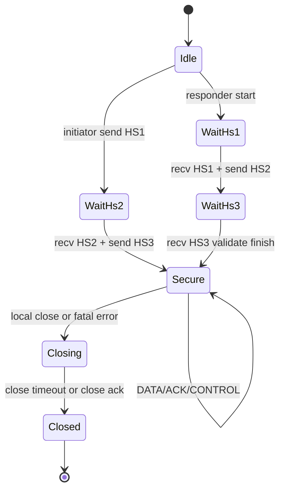

# VEP-004: Session State Machine and Lifecycle Semantics (V1)

- Status: Draft
- Type: Standards Track
- Created: 2026-06-11
- Author: mjojo (https://github.com/GLK-Dev)
- Requires: VEP-001, VEP-003

## 1. Abstract
This proposal defines the canonical V1 session state machine for handshake, secure data transfer, ACK/Error handling, and close semantics.
It provides a common behavioral contract for independent implementations.

## 2. Scope
This VEP defines:

1. Node-side state transitions.
2. Packet acceptance matrix by state.
3. Error and close behavior.

This VEP does not define congestion control details.

## 3. States
1. Idle: no active handshake/session context.
2. WaitHs1: responder waiting for Handshake1.
3. WaitHs2: initiator waiting for Handshake2.
4. WaitHs3: responder waiting for Handshake3.
5. Secure: transport mode active, DATA/ACK/CONTROL valid.
6. Closing: graceful termination in progress.
7. Closed: terminal state.

## 4. State Diagram

## 5. Packet Acceptance by State
1. WaitHs1: only Handshake1 accepted.
2. WaitHs2: only Handshake2 accepted.
3. WaitHs3: only Handshake3 accepted.
4. Secure: Data, Ack, Control, Keepalive, ErrorPacket accepted.
5. Closing: Ack, ErrorPacket, Keepalive accepted; Data MAY be dropped.

Any unexpected packet MUST trigger protocol error handling per VEP-003.

## 6. Session Preconditions
1. session_id MUST be initialized at handshake start.
2. session_id MUST remain constant through Closing.
3. seq replay checks MUST apply in all non-Idle states where packets are processed.

## 7. Error Transitions
1. Malformed packet: emit ERR_MALFORMED_PACKET when possible, then transition to Closing.
2. Negotiation mismatch: emit ERR_NEGOTIATION_ECHO_MISMATCH, then Closing.
3. Replay violation: emit ERR_REPLAY_DETECTED, then Closing.
4. Internal fatal: emit ERR_INTERNAL, then Closing.

## 8. Close Semantics
1. Endpoint SHOULD send ErrorPacket or Control close reason before teardown when feasible.
2. Endpoint SHOULD enforce close timer to avoid half-open sessions.
3. Endpoint MUST move to Closed after timer expiry.

## 9. Interoperability Notes
1. Implementations MUST fail closed on unsupported version.
2. Implementations SHOULD log transitions with reason code.
3. Implementations SHOULD include per-state packet counters for diagnostics.

## 10. Reference
1. VEP-001 wire and handshake framing.
2. VEP-003 error and ACK payload semantics.
