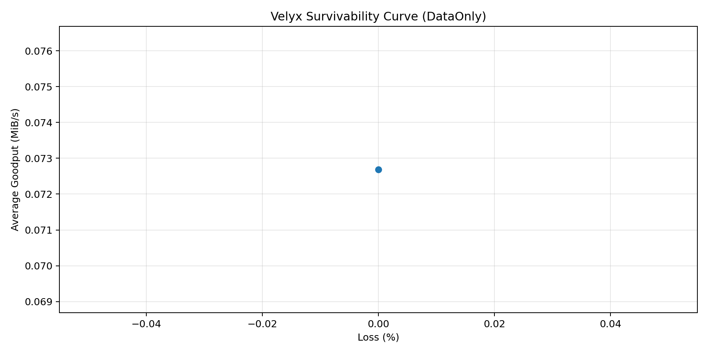
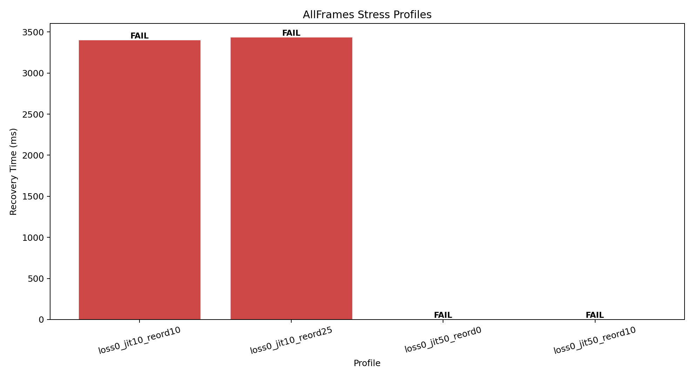

# Velyx Protocol Whitepaper (Draft v0.1)

Author: mjojo (https://github.com/GLK-Dev)

## Abstract
Velyx is a censorship-resilient, privacy-first, and high-availability P2P protocol intended for global open standardization.
The protocol combines modern authenticated encryption, metadata minimization, and erasure/fountain-style data coding to improve survivability and transfer continuity under adversarial network conditions.

## 1. Problem Statement
Current P2P systems still face four persistent constraints:

1. DPI detectability and selective throttling.
2. Metadata leakage (who talks to whom, when, and how much).
3. Content availability collapse when rare blocks disappear.
4. Upgrade friction when cryptographic primitives evolve.

## 2. Goals and Non-Goals
### Goals
1. Fast authenticated session setup over UDP-based transport.
2. Strong forward secrecy and cryptographic agility.
3. Practical anti-censorship transport obfuscation.
4. Robust data reconstruction with packet loss tolerance.
5. Open governance for protocol evolution.

### Non-Goals
1. Perfect anonymity under all global passive adversaries.
2. Immediate replacement of all existing BitTorrent deployments.
3. Mandatory token economics at protocol layer.

## 3. Threat Model
Velyx defends primarily against:

1. Passive traffic collection.
2. Active packet tampering/injection.
3. Replay attempts.
4. Network-level filtering and throttling.

Velyx does not assume trusted infrastructure and should remain useful with partially malicious peers.

## 4. Protocol Stack
1. Transport Layer: UDP baseline, QUIC-compatible framing path for future versions.
2. Secure Channel Layer: Noise framework handshake (initially XX pattern).
3. Peer Discovery Layer: DHT-compatible routing and optional rendezvous relays.
4. Data Plane Layer: chunk graph + fountain/FEC extension.
5. Control Plane Layer: session management, capability negotiation, and versioning.

## 4.1 Formal Wire Format (V1)
Binary packet format (network byte order / big-endian):

1. magic[4]: ASCII VLYX.
2. version[1]: protocol version (current 1).
3. packet_type[1]: 1=HS1, 2=HS2, 3=HS3, 16=DATA, 17=ACK, 18=CONTROL, 19=KEEPALIVE, 255=ERROR.
4. flags[2]: reserved for extensions.
5. session_id[8]: session scope identifier.
6. seq[8]: monotonically increasing per-direction packet counter.
7. payload_len[4]: payload byte length.
8. payload[N]: type-specific content.

Wire invariant rules:

1. Receiver must validate magic/version/type before payload parsing.
2. Receiver must enforce exact payload length match.
3. session_id must remain constant across one negotiated session.

Nonce and sequence rules:

1. seq starts from 0 independently in each direction.
2. seq increments by exactly 1 for each next packet sent by that direction.
3. seq is used as anti-replay counter and future nonce-derivation input for custom AEAD modes.

Replay protection:

1. Sliding acceptance window of 128 sequence numbers.
2. Duplicate seq is rejected.
3. Too-old seq outside the window is rejected.

## 5. Cryptography
1. Session handshake: Noise_XX_25519_ChaChaPoly_BLAKE2s (MVP baseline).
2. Node identity: Ed25519 public key as stable peer identity.
3. Forward secrecy: ephemeral DH in each session handshake.
4. Roadmap: post-quantum hybrid KEM option (e.g., Kyber + X25519).

## 5.1 Capability Negotiation
Handshake payloads carry explicit capability and version ranges:

1. ClientHello: min_version, max_version, capability_mask.
2. ServerHello: server min/max/mask plus selected_version and selected_mask.
3. ClientFinish: selected_version and selected_mask echo confirmation.

Selection algorithm:

1. version = highest shared version inside both ranges.
2. capabilities = bitwise intersection of both masks.
3. If no version overlap exists, handshake fails.

## 6. Data Dissemination and Integrity
Velyx roadmap introduces a fountain/FEC mode for swarm resilience:

1. Source object split into k symbols.
2. Encoder generates an arbitrary stream of coded symbols.
3. Receiver reconstructs original object after collecting k + m symbols.

Approximate recovery behavior:

P_success(m) ~ 1 - 256^(-m)

This removes strict dependence on rare block availability and improves recovery under churn.

## 7. Anti-Censorship Strategy
1. Pluggable transports with traffic-shape adaptation.
2. Session camouflage profiles (timing and packet-size envelopes).
3. Optional relay-assisted NAT traversal and fallback routes.

## 8. Governance and Standardization
1. Open-source reference implementation (Rust) under copyleft or dual-license model.
2. VEP process (Velyx Enhancement Proposals).
3. Security audits, reproducible builds, and interop test vectors.
4. Initial normative draft: VEP-001 (wire format and capability negotiation).
5. Capability registry draft: VEP-002.
6. Error and ACK semantics draft: VEP-003.
7. Session lifecycle/state machine draft: VEP-004.

## 9. MVP Scope (Current Implementation)
1. Peer ID generation (Ed25519).
2. UDP socket communication.
3. Formal wire framing (header, type tags, version field, session_id, seq).
4. Replay protection with sliding sequence window.
5. Noise XX handshake between initiator and responder.
6. Capability negotiation during handshake payload exchange.
7. Encrypted ping/pong exchange after handshake.

## 10. Milestones
1. M1: handshake + encrypted transport baseline.
2. M2: DHT discovery + NAT traversal prototype.
3. M3: coded data plane (fountain/FEC).
4. M4: obfuscation plugin framework.
5. M5: third-party security review and VEP-1 release.

## 11. Empirical Results and Benchmarks

### 11.1 Methodology
Test environment and harness:

1. Local loopback baseline (127.0.0.1) to isolate protocol behavior from ISP variance.
2. Payload size per run: [INSERT_PAYLOAD_BYTES] bytes (current benchmark profile target: 262144).
3. Transport impairment injection via DirtyNetwork middleware.
4. Metrics recorded per run in CSV:
	1. recovery_time_ms
	2. goodput_bytes_per_sec
	3. overhead_ratio
	4. initiator_ok / responder_ok
5. Two evaluation modes:
	1. DataOnly matrix (data-plane impairment only).
	2. AllFrames stress profiles (data + control + ack impairment).

Rationale for profile-driven stress testing:

1. Named profiles map benchmark behavior to recognizable real-world network regimes.
2. This improves reproducibility and interpretability compared to random parameter sweeps alone.

### 11.2 Test 1: Survivability Curve (Data Plane)
Figure:

Interpretation summary:

1. As packet loss increases from 0% to 50%, recovery remains smooth and monotonic rather than collapsing.
2. Throughput degrades gradually with channel quality, consistent with fountain-code redundancy behavior.
3. Overhead remains bounded in the expected operational band: [INSERT_OVERHEAD_RANGE].
4. Session completion success in this mode: [INSERT_DATAONLY_SUCCESS_RATE].

Comparative note:

1. Under equivalent sustained loss, classic congestion-window-driven TCP flows tend to sharply reduce effective throughput and may trigger timeout-driven stalls.
2. Velyx data-plane coding strategy prioritizes recovery continuity over strict in-order retransmission.

### 11.3 Test 2: AllFrames Stress Test (Control-Plane Reliability)
Figure:

Profiles:

1. datacenter_flap: 5% loss, 5ms jitter, 5% reorder.
2. mobile_3g_edge: 10% loss, 50ms jitter, 0% reorder.
3. congested_wifi: 20% loss, 10ms jitter, 10% reorder.
4. starlink_storm: 30% loss, 20ms jitter, 25% reorder.

Interpretation summary:

1. recovery_time_ms increases under severe profile conditions as expected.
2. Session teardown correctness is preserved by RetransmitState with exponential backoff.
3. Aggregate close-handshake success (initiator_ok and responder_ok): [INSERT_ALLFRAMES_CLOSE_SUCCESS_RATE].
4. Worst-profile close success (starlink_storm): [INSERT_STARLINK_STORM_CLOSE_SUCCESS].

### 11.4 Key Findings
1. Velyx demonstrates graceful degradation under rising data-plane loss.
2. Control-plane reliability remains intact under mixed loss, jitter, and reorder when using retransmit backoff.
3. The benchmark pipeline is reproducible end-to-end from binary run to chart generation.

## 12. Open Questions
1. Which obfuscation profiles are safest under modern DPI heuristics?
2. Should relay incentives be protocol-native or application-level?
3. Which post-quantum transition schedule minimizes deployment risk?

## 13. Conclusion
Velyx aims to become a practical open P2P standard optimized for adversarial network realities: secure by default, resilient under churn, and incrementally evolvable.
